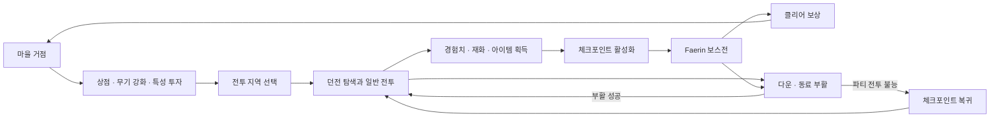
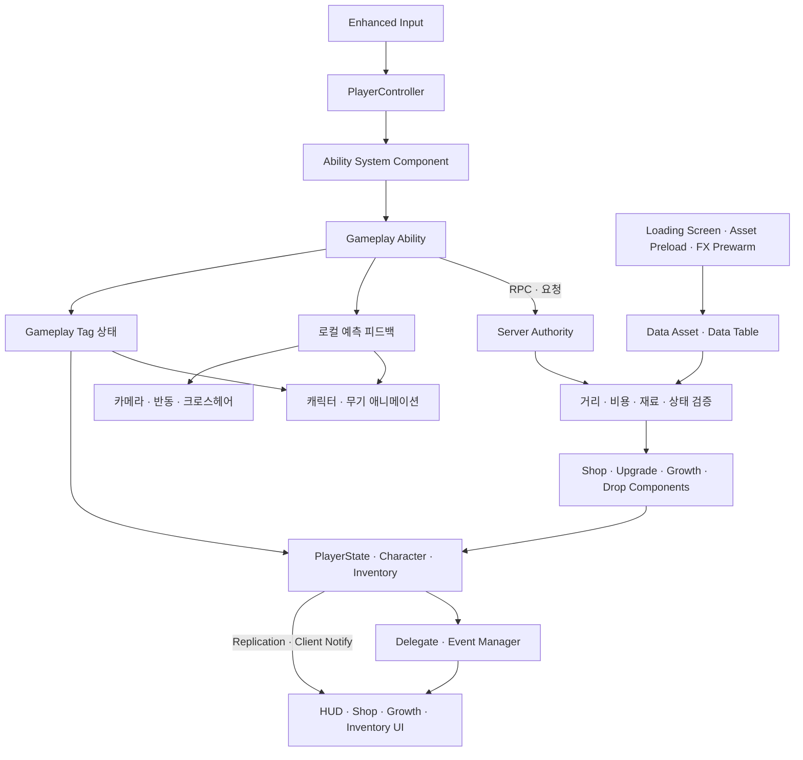

[Revenant_Protocol_README.md](https://github.com/user-attachments/files/30591567/Revenant_Protocol_README.md)
# Revenant Protocol

> 거점에서 전투를 준비하고 던전을 공략해 성장한 뒤, 동료와 함께 강력한 보스에 도전하는 3인 협동 TPS 슈터 RPG


[](https://youtu.be/Us77PEwWSoo)

[플레이 영상](https://youtu.be/Us77PEwWSoo) · [GitHub 저장소](https://github.com/dsw2679/ProjectR_Repo)

## 목차

1. [프로젝트 개요](#프로젝트-개요)
2. [게임 소개](#게임-소개)
3. [핵심 플레이 흐름](#핵심-플레이-흐름)
4. [게임 콘텐츠와 특징](#게임-콘텐츠와-특징)
5. [담당 구현](#담당-구현)
6. [기술 스택](#기술-스택)
7. [전체 아키텍처](#전체-아키텍처)
8. [주요 구현 시스템](#주요-구현-시스템)
9. [프로젝트 구조](#프로젝트-구조)
10. [빌드 및 실행](#빌드-및-실행)
11. [조작 방법](#조작-방법)
12. [구현 결과](#구현-결과)
13. [개발자](#개발자)

## 프로젝트 개요

| 항목 | 내용 |
| --- | --- |
| 프로젝트 형태 | 4인 팀 프로젝트 |
| 장르 | 3인 협동 TPS 슈터 RPG |
| 개발 기간 | 2026.04.20 ~ 2026.06.19 (9주) |
| 엔진 | Unreal Engine 5.6 |
| 개발 언어 | C++, Blueprint |
| 플랫폼 | Windows |
| 핵심 기술 | Gameplay Ability System, 서버 권한 멀티플레이, Data Asset/Data Table, CommonUI, Behavior Tree/EQS, Niagara |
| 버전 관리 | Git, Perforce |

## 게임 소개

**Revenant Protocol**은 최대 3명의 플레이어가 협력해 마을, 던전, 보스 룸을 오가며 전투와 성장을 반복하는 3인칭 슈터 RPG입니다.

플레이어는 거점에서 아이템을 구매하고 무기를 강화하며 성장 특성에 포인트를 투자합니다. 준비를 마치면 던전으로 이동해 일반 몬스터를 상대하고 경험치, 재화, 강화 재료와 아이템을 획득합니다. 전투에서 얻은 성장을 바탕으로 체크포인트를 지나 보스 **Faerin**의 다단계 패턴에 도전하는 것이 핵심 목표입니다.

사격과 조준뿐 아니라 스태미나를 사용하는 무적 회피, 무기별 조작감, 특수 모드, 다운과 부활을 결합해 개인의 전투 판단과 파티 협력을 함께 요구하도록 구성했습니다.

## 핵심 플레이 흐름



1. 마을의 NPC와 상호작용해 소모품을 구매하고 무기와 성장 능력치를 정비합니다.
2. 웨이포인트를 통해 던전으로 이동해 역할이 다른 적들을 상대합니다.
3. 전투 보상으로 경험치, 스크랩, 강화 재료, 아이템과 탄약을 획득합니다.
4. 체크포인트를 확보하고 파티 상태를 정비한 뒤 보스 룸에 진입합니다.
5. 보스의 페이즈와 패턴에 대응해 클리어 보상을 획득하고 거점으로 돌아옵니다.

## 게임 콘텐츠와 특징

### TPS 전투와 회피

- 조준, 사격, 재장전, 무기 교체와 카메라 반동을 결합한 3인칭 총기 전투
- 이동 입력 방향으로 구르는 회피와 입력이 없을 때 사용하는 백스텝
- 스태미나 소모와 무적 구간으로 공격과 회피 사이의 자원 판단 제공
- 조준 및 무기 줌에 따라 카메라 거리와 FOV가 전환되는 시점 피드백
- 체력과 별도로 경직 수치를 운용해 공격의 저지력과 피격 반응을 표현

### 무기와 특수 모드

- 권총, 돌격소총, 볼트액션 라이플, 유탄 및 미사일 계열 등 서로 다른 운용 방식을 가진 무기
- 피해를 가해 충전한 모드 게이지로 특수 능력을 사용하는 전투 확장 구조
- 화염 투사체, 회복, 지원 드론, 배리어 등 공격·생존·지원 역할의 무기 모드
- 무기별 기본 데이터와 개별 인스턴스의 강화 레벨을 분리한 성장 구조

### 협동 생존

- 리슨 서버 기반의 협동 세션과 파티원 상태 HUD
- 체력이 0이 되면 즉시 전투에서 이탈하지 않고 동료의 도움을 기다리는 다운 상태
- 제한 시간 내 부활에 실패하거나 모든 전투 참가자가 행동 불능이 되면 파티 전멸 처리
- 체크포인트를 기준으로 전투 흐름을 복구하는 재도전 구조

### 적과 보스

- 근거리 압박, 원거리 견제, 방어와 돌진 등 역할이 다른 일반 적 구성
- Behavior Tree, EQS와 Gameplay Ability를 결합한 적 행동 및 패턴 실행
- 순간 이동, 포털, 투사체, 분신, 광역 공격과 페이즈 전환을 사용하는 **Faerin** 보스전
- 보스 체력, 페이즈 BGM, 전투 연출과 UI를 연결한 전용 전투 흐름

### 성장과 보상

- 전투 경험치에 따른 레벨업과 특성 포인트 획득
- 최대 체력, 방어력, 공격력, 이동 속도, 스태미나, 치명타 관련 능력치 투자
- 스크랩과 재료를 사용하는 상점 구매·판매 및 최대 `+5` 무기 강화
- 몬스터별 드롭 데이터에 따른 재화, 아이템, 탄약과 경험치 보상
- 인벤토리, 퀵슬롯, 아이템 툴팁과 픽업 알림을 포함한 HUD/UI 흐름

## 담당 구현

- **GAS 기반 플레이어 전투와 애니메이션 흐름**: 회피, 달리기, 앉기, 조준, 무기 줌, 사격 반동, 피격 경직, 다운과 사망 상태를 Gameplay Ability와 Gameplay Tag로 연결했습니다.
- **서버 권한형 경제·성장 시스템**: 상점 거래, 무기 강화, 특성 투자, 재화 및 아이템 드롭 요청을 서버에서 검증하고 결과를 복제하도록 구현했습니다.
- **데이터 중심 콘텐츠 구조**: 무기, 아이템, 상점 가격, 강화 비용, 성장 수치, 드롭 보상을 Data Asset과 Data Table로 분리해 코드 수정 없이 수치를 조정할 수 있도록 구성했습니다.
- **NPC 상호작용과 UI 연동**: 상점, 무기 강화, 성장 창을 NPC 상호작용에서 호출하고 HUD, 재화 표시, 픽업 알림, 파티 및 보스 체력 UI에 상태 변화를 반영했습니다.
- **다운·사망·파티 전멸 흐름**: 서버 시간을 기준으로 다운 제한 시간을 동기화하고 전투 참가자의 상태를 재평가해 부활, 사망, 전멸과 체크포인트 복귀를 연결했습니다.
- **카메라와 전투 피드백**: 기본, 조준, 무기 줌 카메라 모드와 FOV 전환, 반동 Camera Modifier, 크로스헤어 및 무기 애니메이션을 연동했습니다.
- **로딩 화면과 런타임 프리웜**: Unreal Insights로 첫 상점 진입과 첫 사격 시점의 로딩 비용을 확인하고, 맵 및 런타임 에셋을 로딩 화면에서 프리로드·렌더 프리웜하도록 구성했습니다.

## 기술 스택

| 구분 | 기술 |
| --- | --- |
| Engine | Unreal Engine 5.6 |
| Language | C++, Blueprint |
| Ability | Gameplay Ability System, Gameplay Effect, Gameplay Tag, Gameplay Cue |
| Network | Replication, RPC, Listen Server, Online Subsystem Null |
| Input | Enhanced Input |
| Animation | Animation Montage, Linked Anim Instance, Aim Offset, Motion Warping, IK |
| AI | Behavior Tree, EQS, AI Perception |
| UI | UMG, CommonUI, Slate |
| Data | Primary Data Asset, Data Asset, Data Table, Developer Settings |
| Effects | Niagara |
| Profiling | Unreal Insights |
| Version Control | Git, Git LFS, Perforce |

## 전체 아키텍처



입력과 액션 실행은 `PlayerController`와 ASC를 중심으로 분리했습니다. 즉각적인 조작감이 필요한 사격·회피·카메라 피드백은 로컬에서 먼저 반응하고, 거래·강화·성장·보상처럼 결과의 신뢰성이 필요한 기능은 서버가 검증하고 확정합니다. 데이터와 UI는 컴포넌트 및 이벤트를 통해 연결해 게임 규칙과 표현 계층의 의존성을 줄였습니다.

## 주요 구현 시스템

### 로컬 예측 기반 Gameplay Ability

- 사격과 회피처럼 입력 반응성이 중요한 Ability는 `LocalPredicted` 정책으로 실행합니다.
- 회피 시작 시 이동 방향을 한 번만 샘플링해 이동 입력이 있으면 방향 구르기, 없으면 백스텝으로 결정합니다.
- Ability 활성화와 방향 RPC의 도착 순서에 의존하지 않도록 서버에 방향 정보를 보관하고 준비된 시점에 회피를 시작합니다.
- `Dodge`, `Aim`, `Down`, `Reloading`과 같은 상태를 Gameplay Tag로 표현해 이동, 애니메이션, UI와 다른 Ability의 실행 조건이 동일한 상태를 참조하도록 했습니다.
- 카메라 반동, 크로스헤어 확장과 몽타주는 로컬에서 먼저 재생하고 실제 피해와 공유 상태는 서버 결과를 따릅니다.

### 서버 권한형 거래와 보상

- 클라이언트는 구매·판매·강화·특성 투자 의도만 요청하고 실제 결과는 서버가 결정합니다.
- 상점은 플레이어와 NPC의 거리, 요청 간격, 상품, 재고, 인벤토리 공간, 스크랩과 재료 보유량을 확인합니다.
- 재화와 재료를 소비한 뒤 후속 처리에 실패하면 환불 경로를 실행해 거래 상태를 복구합니다.
- 드롭 매니저는 서버에서 몬스터 사망 보상을 계산하고 경험치, 재화, 아이템과 탄약을 즉시 지급하거나 월드 픽업으로 생성합니다.
- 월드 보상은 `ProjectileMovement`의 바운스와 정지 판정을 사용하고, 불필요한 매 프레임 Tick 없이 착지 후 획득 가능 상태로 전환합니다.

### 무기 강화와 특성 성장

- `WeaponDataAsset`은 무기의 정적 규칙을, `WeaponInstance`는 개별 무기의 강화 레벨을 담당합니다.
- 강화 컴포넌트가 최대 레벨, 비용과 재료를 서버에서 검증한 뒤 인스턴스의 강화 수치를 갱신합니다.
- 특성 창은 투자 결과를 먼저 미리 보여주고, 확정 요청을 받은 서버가 남은 포인트와 투자 가능 여부를 검사합니다.
- 실제 사격 시점에 무기 기본 피해와 강화 레벨을 계산하고 플레이어의 공격력 특성을 Damage Spec에 함께 반영합니다.
- 성장 수치는 소유 클라이언트에 복제해 HUD와 상세 정보가 실제 서버 상태를 표시하도록 했습니다.

### 다운·사망·파티 전멸 판정

- 체력이 0이 되었을 때 전투 가능한 동료가 남아 있으면 다운 상태로 전환하고 부활 기회를 제공합니다.
- 다운 종료 시각을 `PlayerState`에 서버 절대 시간으로 저장하고, 클라이언트는 동기화된 서버 시간을 사용해 남은 시간을 표시합니다.
- `GameMode`는 플레이어의 다운·사망 상태가 바뀔 때만 전투 참가자를 재평가합니다.
- 모든 참가자가 전투 불능이면 파티 전멸을 한 번만 실행하고 체크포인트 기반 복귀 흐름을 시작합니다.
- 아직 전투에 참여하지 않은 플레이어는 전멸 판정에서 제외해 세션 참가 시점에 따른 오판을 방지합니다.

### 카메라와 피격 애니메이션

- `SpringArmComponent`가 기본, 조준, 무기 줌 모드의 거리와 오프셋을 관리합니다.
- `CameraManager`와 `CameraModifier`가 목표 FOV와 적용 Alpha를 분리해 줌 진입·해제와 반동을 부드럽게 합성합니다.
- 카메라 처리는 로컬 소유 플레이어에게만 적용해 네트워크 캐릭터의 시점 상태와 분리했습니다.
- 강한 피격 시 하나의 몽타주에서 `Start → FallLoop → Land → GetUp` 섹션을 제어합니다.
- `FallLoop` 동안 캡슐 하단을 Sphere Sweep해 착지 가능한 경사를 확인하고, 지면이 감지되면 `Land` 섹션으로 전환합니다.

### 로딩 화면과 에셋 프리웜

- `LoadingScreenSubsystem`이 레벨 전환 전후의 오버레이와 필수 에셋 로딩 수명을 관리합니다.
- `MapPreloadDataAsset`과 `RuntimePreloadDataAsset`으로 맵별·공통 프리로드 대상을 분리했습니다.
- Niagara 시스템, 상호작용 외곽선, 상점 UI와 캐릭터 관련 에셋을 로딩 구간에서 미리 로드하거나 렌더 프리웜합니다.
- 한 프레임에 작업이 몰리지 않도록 프리웜 요청을 분산해 첫 사용 시 발생할 수 있는 렌더링 히칭을 완화했습니다.

## 프로젝트 구조

```text
ProjectR_Repo/
├─ Config/                              # 엔진, 맵, 입력과 네트워크 설정
├─ Content/
│  ├─ 0_BP/
│  │  ├─ Data/                         # 무기, 아이템, 모드와 월드 데이터
│  │  ├─ Enemies/                      # 일반 적과 Faerin 보스 콘텐츠
│  │  ├─ Player/                       # 플레이어 Ability, Effect와 상태 에셋
│  │  ├─ UI/                           # HUD, 상점, 성장, 인벤토리와 메뉴
│  │  ├─ Weapon/                       # 무기 Blueprint와 애니메이션 연결
│  │  └─ World/                        # 드롭, 스포너와 월드 오브젝트
│  ├─ 1_Maps/                          # Menu, Town, Dungeon, Sector09 등
│  ├─ 2_Characters/                    # 캐릭터 모델과 애니메이션 리소스
│  └─ 3_Effects/                       # Niagara, 머티리얼과 UI 이펙트
├─ Docs/                               # 게임 디자인과 플레이 가이드
├─ Source/ProjectR/
│  ├─ AbilitySystem/                   # Ability, Effect, Attribute와 계산식
│  ├─ AI/                              # 보스·일반 적 AI, BT와 EQS
│  ├─ Animation/                       # 플레이어·무기 Anim Instance와 Notify
│  ├─ Game/                            # GameMode, GameInstance와 세션
│  ├─ Interaction/                     # NPC와 월드 상호작용
│  ├─ ItemSystem/                      # 인벤토리, 무기, 강화와 아이템 데이터
│  ├─ Player/                          # Controller, State, Camera와 성장 컴포넌트
│  ├─ Shop/                            # 상품 데이터와 서버 거래 로직
│  ├─ System/                          # Asset Manager, 로딩과 공용 설정
│  ├─ UI/                              # HUD, 상점, 성장, 강화와 인벤토리 UI
│  └─ World/                           # 드롭, 픽업과 월드 진행 요소
└─ ProjectR.uproject
```

## 빌드 및 실행

### 요구 환경

- Windows 10/11
- Unreal Engine 5.6
- Visual Studio 2022
  - **Game development with C++** 워크로드
  - Windows SDK
- Git LFS

### 실행 순서

1. 저장소와 Git LFS 에셋을 내려받습니다.

   ```bash
   git lfs install
   git clone https://github.com/dsw2679/ProjectR_Repo.git
   cd ProjectR_Repo
   git lfs pull
   ```

2. `ProjectR.uproject`를 우클릭해 **Generate Visual Studio project files**를 실행합니다.
3. 생성된 솔루션을 열고 `Development Editor | Win64` 구성으로 `ProjectREditor`를 빌드합니다.
4. `ProjectR.uproject`를 열어 Unreal Editor를 실행합니다.
5. 기본 시작 맵인 `L_Menu`에서 싱글 플레이 또는 협동 세션을 시작합니다.

### 협동 세션

- 호스트는 시작 화면에서 **StartHost**를 선택합니다.
- 참가자는 호스트 PC의 LAN IP를 입력한 뒤 **Join**을 선택합니다.
- 현재 저장소는 `OnlineSubsystemNull`을 사용하는 LAN 세션으로 구성되어 있습니다.

> 맵 파일(`.umap`)은 Git LFS로 관리되므로 `git lfs pull`을 완료한 뒤 프로젝트를 열어야 합니다.

## 조작 방법

| 입력 | 동작 |
| --- | --- |
| `W` `A` `S` `D` | 이동 |
| `Left Shift` | 달리기 |
| `Space` | 회피 |
| `C` | 앉기 |
| 마우스 왼쪽 버튼 | 사격 |
| 마우스 오른쪽 버튼 | 조준 |
| `R` | 재장전 |
| `F` | 무기 모드 사용 |
| 마우스 휠 | 무기 변경 |
| `E` | 상호작용 / 홀드 상호작용 |
| `Tab` | 인벤토리 열기 |
| `1` `2` `3` `4` | 퀵슬롯 사용 |

> 입력은 Enhanced Input Mapping Context로 관리되며 프로젝트 설정에 따라 변경될 수 있습니다.

## 구현 결과

- 9주간의 4인 팀 프로젝트로 마을 준비, 던전 전투, 보상과 성장, 체크포인트, 보스 공략으로 이어지는 전체 플레이 흐름을 완성했습니다.
- GAS와 Gameplay Tag를 중심으로 입력, 전투 상태, 애니메이션, 카메라와 UI가 같은 상태 모델을 공유하도록 구성했습니다.
- 즉각적인 전투 피드백은 로컬 예측으로 처리하고 거래·성장·보상은 서버가 확정하도록 책임을 분리했습니다.
- Data Asset과 Data Table을 통해 무기, 상점, 강화, 성장과 드롭 규칙을 콘텐츠 데이터로 관리했습니다.
- 다운·부활·전멸 판정과 파티 HUD를 연결해 협동 플레이의 생존 흐름을 구현했습니다.
- Unreal Insights 분석을 바탕으로 로딩 화면의 프리로드·렌더 프리웜을 적용해 첫 사용 시 히칭을 완화했습니다.

## 개발자

**김동석**

- GitHub: [dsw2679](https://github.com/dsw2679)
- Email: [dsw2679@naver.com](mailto:dsw2679@naver.com)
- Play Video: [YouTube](https://youtu.be/Us77PEwWSoo)
